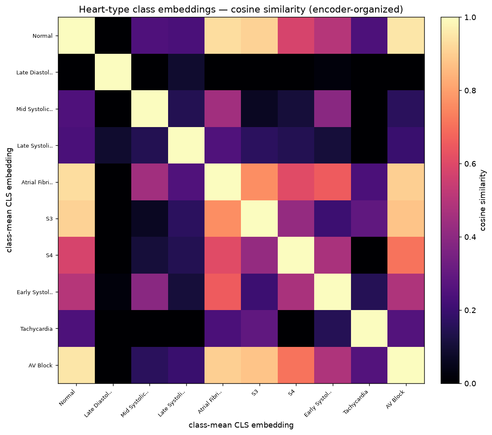

# LLM Integration — Personalized Auscultation Reports

An automated, *personalized* auscultation report: the classifier heads produce
structured, probabilistic findings; a language model (or an offline
synthesizer) turns them into a plain-language narrative with **medical, diet and
environment** recommendations, grounded in the findings and in the user's stated
context and conversation.

> ⚠️ Educational / research prototype. Anything produced here is **not** a
> diagnosis, prescribing advice or clinical guidance — always defer to a
> qualified clinician.

## 1. Architecture

```text
audio ─▶ head ensembles (post-softmax probs)
              │
              ▼
      structured findings  {head, classes, probs, pred, confidence}
              │
          patient context / conversation (opt-in)
              ▼
   ┌────────────────────────────────────────────────┐
   │ LLMClient  (OpenAI-compatible API, if configured)│
   │ LLMSynthesizer (offline rule-based fallback)      │
   └────────────────────────────────────────────────┘
              ▼
    {summary, findings, recommendations{medical,diet,environment},
     next_steps, provider, model, disclaimer}
```

Both providers return the **same JSON shape**, so the web app, tests and
consumer integrations are provider-agnostic (`webapp/app/llm.py`).

- **LLMClient** calls an OpenAI-compatible `POST /chat/completions` endpoint and
  asks for a JSON object with the schema above. Enabled only when
  `CARDIASENSE_LLM_API_KEY` is set; any failure falls back to the synthesizer.
- **LLMSynthesizer** is a deterministic, offline generator: per-head findings +
  a per-class knowledge base (`medical / diet / environment` recommendation
  outlines), personalised with context hints (asthma, smoking, palpitations,
  cough, hypertension, …). It keeps the product working, testable and
  demo-able with zero API dependency.

## 2. Personalization

- **Health records / user notes** (`patient_context`): the report is written in
  the light of these notes (e.g. age, asthma, smoking, symptoms). Generated via
  a patient-context text field or `POST /api/llm/report`.
- **Conversation history** (`history`): follow-up questions are answered with
  the previous messages as context, so the interaction feels like a chat.
- **Privacy posture**: the system is **anonymous by default** (no patient
  identity is required). Health details are only sent to the LLM when the user
  explicitly provides them; a production build must add explicit consent,
  encryption, retention policy and — where required — on-prem/local models.

## 3. Recommendations taxonomy and guardrails

Recommendations are structured into three areas:

| area | examples |
|---|---|
| **medical** | "Evaluate for asthma/COPD with a clinician", "Confirm AF with a 12-lead ECG" |
| **diet** | "Prefer a low-sodium pattern if blood pressure is high", "Warm fluids for mucus" |
| **environment** | "Reduce smoke, dust and strong fumes", "Keep indoor humidity moderate" |

Guardrails encoded in the prompt and the synthesizer:

- Output is explicitly **educational, not a diagnosis**; every response carries
  the project disclaimer.
- The model is instructed not to invent blood tests, lab values or diagnoses,
  and to tie every recommendation to the actual findings.
- Sensitive care suggestions (e.g. chest pain) point toward urgent clinical
  review.

## 4. Provider configuration

| env var | default | purpose |
|---|---|---|
| `CARDIASENSE_LLM_API_KEY` | *(unset)* | enables the LLM path |
| `CARDIASENSE_LLM_BASE_URL` | `https://api.openai.com/v1` | any OpenAI-compatible endpoint (e.g. local Ollama: `http://localhost:11434/v1`) |
| `CARDIASENSE_LLM_MODEL` | `gpt-4o-mini` | model name/handle |
| `CARDIASENSE_LLM_TIMEOUT` | `30` | request timeout (s) |

Without a key, reports are generated by the offline synthesizer (provider
field says `synthesizer`).

## 5. API surface

- `POST /api/llm/report` — `{findings, patient_context, history}` →
  structured narrative (used by the report page's follow-up chat).
- `POST /analyze`, `POST /api/analyze` — accept `patient_context` and
  `ai_narrative`; the report then includes an **AI narrative** section.

---

# Research directions

## A. A token/embedding architecture for audio + LLM

The audio Transformer encoder is already a tokenizer of sorts: its **patch
embeddings** and **pooled CLS embedding** live in one ordered, class-organised
space. Hypothesis: instead of re-embedding raw audio with a separate component,
**reuse the encoder's tokens** as the interface to a language model.

- Implemented: `ASTSmall.encode()` returns `(patch_tokens, cls_embedding)`;
  `ml/cardia/features/embeddings.py` + `scripts/extract_embeddings.py` dump
  per-clip CLS embeddings and the class organization. The class-mean cosine
  similarity shows the encoder has already arranged heart-type classes in
  embedding space:

  

- Two concrete LLM wiring options:
  1. **Frozen encoder + linear projection** — project `cls`/token vectors into
     the LLM's embedding dimension (a small learned adapter), then let the LLM
     attend to "audio tokens" interleaved with text tokens.
  2. **Patch-token sequence as soft prompts** — feed the ordered patch-token
     sequence as prefix tokens to a decoder-only model, conditioned on the
     prompt; the encoder's order/semantics are preserved.

- Measured cost: the served Transformer head is **~0.34 GFLOPs, ~2 MB int8**
  (see `docs/MobileCompute.md`), so a frozen encoder encoder on-device + cloud
  LLM is a plausible split.

## B. Whole-breathing-cycle modeling

A single 1–3 s snippet is often ambiguous: it may catch only part of a cycle or
miss the pattern altogether, and a "quick sound" can look normal while the
full cycle is not. Proper auscultation (and a proper diagnosis) wants the whole
breathing/cardiac cycle — and often several cycles.

Current status: the app's **macro pass already uses the entire 15 s clip**
(≈ several cycles at rest), and the multi-scale view adds 1 s / 3 s windows for
localisation. Open directions:

1. **Cycle segmentation** — estimate breathing-cycle boundaries from the lung
   envelope, then model per-cycle embeddings with cross-cycle attention, so
   "this pattern repeats on 3 of 5 cycles" becomes an explicit feature.
2. **Long-context / streaming encoder** — extend (or condition) the encoder for
   longer recordings (real exams are minutes, not 15 s) using e.g. temporal
   downsampling + recurrent/attention compression, or chunked-token fusion at
   the LLM level (research direction A composes directly with this).
3. **Cycle-aware training** — supervision at cycle level (start/end, per-cycle
   label agreement) rather than clip level, to reduce label noise from short
   clips.
4. **Data** — HLS-CMDS is 15 s clips; validating cycle/whole-cycle modeling
   needs longer recordings (e.g. bedside/field recordings) as an external set.

Proposed experiment: train a cycle-segmented variant on the lung task, compare
macro (whole-clip) vs cycle-aggregated vs per-window metrics, and report
balanced-accuracy / calibration with confidence intervals — auditable the same
way the benchmark is.

## 6. Evaluation and safety plan

- Compare synthesizer vs LLM outputs on the same findings for consistency of
  facts (recommendation grounding) and disclaimer presence.
- Human review: a clinician checklist for a small sample of reports
  (no false reassurance, no invented labs, no dangerous advice).
- Red-teaming prompts: adversarial patient contexts, "am I dying?"‑style
  questions, refusal/redirect behaviour.
- Keep calibration: the narrative should convey confidence honestly, tracking
  the measured ECE of the heads.