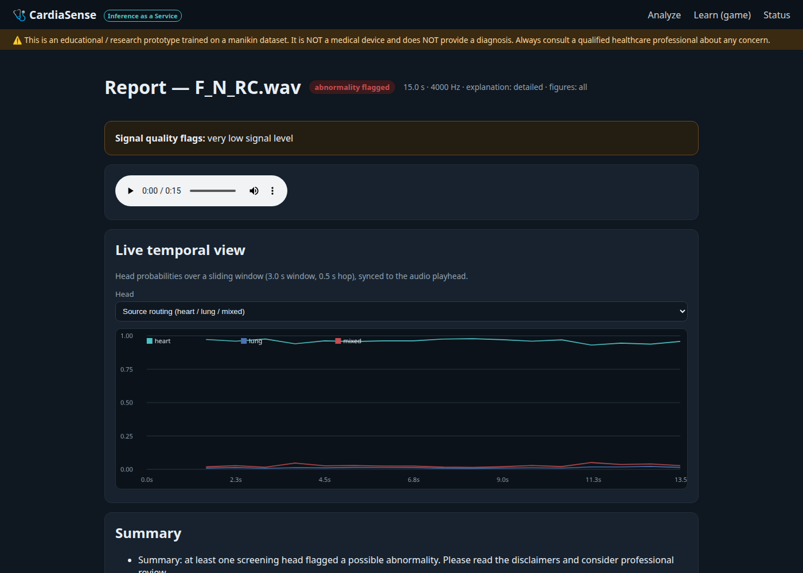
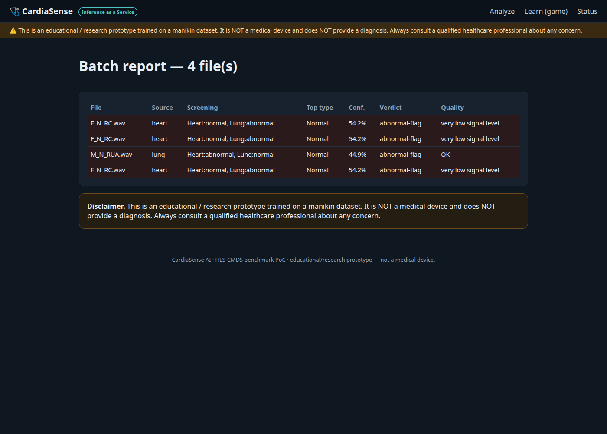

# Instructional Usage Walkthrough

A step-by-step tour of the Asculto web app — **Inference-as-a-Service** and
the **educational game**. Screenshots are generated automatically by
`scripts/screenshot_walkthrough.py` (see the bottom of this page).

> ⚠️ Educational / research prototype. Not a medical device, not a diagnosis.

## 0. Start the app

```bash
./setup.sh                                                   # venv + deps + dataset
.venv/bin/python -m uvicorn webapp.app.main:app --port 8010
# open http://localhost:8010
```

## 1. Landing — upload single or batch

Choose files (one for a full report, several for a batch table), select the
prediction heads, explanation depth, figure level, and the temporal mode
(single window or multi-scale). A built-in demo link renders a report from a
dataset clip without uploading.


## 2. Report — summary and predictions

Every report opens with a verdict banner, signal-quality flags, an embedded
audio player, a plain-language narrative, and a prediction table showing each
head's class and ensemble confidence.



## 3. Report — figures

The figures section shows the input **waveform**, the **band-pass overlay**, the
**log-mel spectrogram**, and a **post-softmax probability chart per head** — so
the input processing and the model's decision are visible together.


## 4. Report — synchronized inference timeline

The key output: a single time-aligned figure with the **input spectrogram**
(top), **stacked-area head probabilities** over time (middle), and the
**confidence line + predicted-class ribbon** (bottom), all sharing one time axis.
This shows how the assessment evolves across breathing/cardiac cycles rather
than a single full-clip label.


## 5. Batch analysis

Uploading many clips produces a table: source routing, screening verdict, top
type and confidence, overall verdict, and quality flags — with the per-file
reports available on demand.



## 6. Learn — the educational game

A scored listening drill using the dataset's ground-truth labels. Pick a domain,
play the clip, choose the answer, and get an explanation of the correct sound.


## 7. JSON API (programmatic IaaS)

```bash
curl -F "files=@clip.wav" -F "heads=source,heart_types,lung_types" \
     -F "temporal=true" -F "temporal_mode=multiscale" \
     http://localhost:8010/api/analyze
```

Returns per-head probabilities, the multi-scale series, the fused prediction,
and base64 figures. Other endpoints: `GET /health`, `GET /api/game/round`,
`POST /api/game/answer`, `GET /game/audio/{sample_id}`.

## Regenerating these screenshots

```bash
.venv/bin/python scripts/screenshot_walkthrough.py     # writes docs/walkthrough/*.png
```

The script starts the server if needed and captures the landing page, report
summary, figures, synchronized timeline, batch table, and game using Playwright
with the system Chromium.
